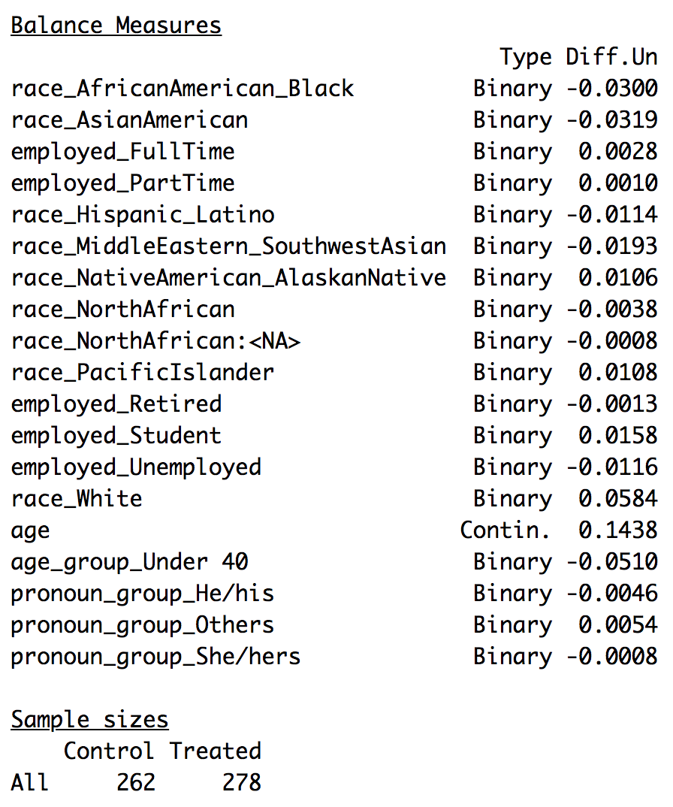

```{r setup, include=FALSE}
knitr::opts_chunk$set(echo = FALSE, message = FALSE, warning = FALSE, prompt = TRUE, fig.pos = 'H', comment=NA)
knitr::knit_hooks$set(plot = knitr::hook_plot_tex)
```

\newpage
\tableofcontents
\newpage
\listoffigures
\listoftables
\newpage

```{r message=FALSE}
# install.packages("ggpubr")
# install.packages("cobalt")
# install.packages("MatchIt")
# install.packages("kableExtra")
# install.packages("gridExtra")
```

```{r message=FALSE, results="hide"}
# loading various libraries
library(data.table)
library(stargazer)
library(dplyr)
library(foreign)
library(lmtest)
library(sandwich)
library(AER)
library(ggplot2)
library(corrplot)
library(devtools)
library(ggpubr)
library(cobalt)
library(MatchIt)
library(knitr)
library(kableExtra)
library(gridExtra)
```

## 1. Introduction

### Context

Though email was originally conceived as a means of communication amongst academics in 1965, it has been ubiquitous in our society and workplace for a couple decades or more. A common etiquette for emails has become informally established, such as writing in all capital letters to denote yelling. However, emails lack the body language or tonal cues of face-to-face communication or phone conversations. This can cause misinterpretation regarding the intent and tone of the sender of an electronic message.

The use of emoticons, like smiley faces, are currently popular for digital expression but have previously been perceived to be inappropriate for office correspondence. Recently, the rise of messsaging applications in white collar office settings, such as Slack or Google Hangouts, not only provide a suite of emoticons for communicaton but also integrations with entertainment based communication, such as Giphy. As the amount of options for digital expression increase, has the perception of coworkers based on digital behaviors, antiquely coined “netiquette”, relaxed as well?

In addition, it has become increasingly important for an office worker to fit into the culture of a workplace and be perceived as a team player. In the personal experience of one the authors, a professionally written email was perceived to be too formal and cold by a peer. Perhaps a well-placed emoticon or slightly more casual phrasing in this email would have yielded more benefit by imbuing a friendly quality to the message than it would have suffered from a slightly lower perception of professionalism. This was the impetus behind our research question.

### Core Research Question

We have designed and implemented an experiment to determine if the increased usage of emoticons, emphatic punctuation, and informal writing tone in an email causes the recipient to have a more or less favorable perception of warmth, competence, or professionalism regarding the sender.

### Hypothesis

We test the sharp null hypothesis that no individual treatment effect exists between people who read through a traditional email and an informal one. However, we expect that there will likely be a positive treatment effect in the perception of warmth of the sender, while there would be negative treatment effects in the perception of competence and perception. 

## 2. Experimental Design

### Outcome Variable

In order to accurately capture the phenomenon of "perception", we carefully designed our potential outcomes with three factors in mind. 

First, we needed our outcome variable to be as directly related to the concept of "perception" as possible. To achieve this, we decided to design a series of statements about the sender and required the subjects to rate how much they agreed with them on a seven-point Likert scale. 

Second, we needed our outcome variable to reflect the various aspects of workplace perception that have tangible impacts on coworking and performance. We didn't want to waste time with trivial perceptions, like "This person is really fun!" or "I want this person to cook me a meal!". To achieve this, we designed statements that fell into three broad dimensions: warmth, professionalism, and competence. 

Third, we wanted to account for the variance of interpretations each person had for each statement. For example, one person may interpret the statement "This person is easygoing" much differently than someone else. To achieve this, we provided 5 statements in each dimension (15 statements total) that asked about each dimension from a slightly different angle.

With this observation regiment in place, our potential outcomes to control and treatment are the ordinal numeric representation of the average Likert scores, with the ability to be subdivided by dimension and question.

### Randomization Process

We designed and deployed a survey on Qualtrics to deliver our experiment to participants from two sample sources: personal channels (MIDS communication channels such as Slack) and Amazon Mechanical Turk. We utilized two of Qualtrics' randomization features: randomizing treatment assignment, in pseudo-alternating fashion to ensure roughly equal sample sizes, and randomizing the order of our outcome evaluation statements.

Since we are interested in measuring the impacts of digital behaviors on perceptions of an email sender, and *only* digital behaviors, we drafted two simulated emails with identical content. Both emails greeted the recipient, established a business problem context, and asked for the recipient to perform a task. Before reading the emails, the subjects were briefed on the scenario which we've provided below:

*"Riley and Jordan both work in the Business Intelligence group of a major global retailer. Jordan sent the following email to Riley on a Monday morning. Please read the email and record your answers to the questions on the following page."*

### Treatment Details

Our survey is structured into three sections: Demographic data collection, treatment exposure, and professional perception evaluation.

After confirming consent from the participant, the subjects are informed that they would be a part of a study in email communication, but were not made aware of the treatment effect we were testing, establishing a single-blind experiment. Before being exposed to the control or treatment email, the survey presents a series of questions aimed towards collecting information about the participant’s demographics. We ask questions about the participant’s gender identity, sexual orientation, race, age, highest education, current employment status, and current location. The participant has the ability to decline to report any or all of the demographic questions.

Following the demographic questions, the survey presents the participant with an email to read through. We utilize Qualtric’s randomization mechanism to assign participants to either the control or treatment groups. If the participant was assigned to the control group, they received an email composed with neutral language and minimal use of emotional punctuation. If the participant was assigned to the treatment group, they received an email with more emotional language and maximal use of emotional punctuation. Both emails contain the same content, including context about a time-sensitive work project followed by a direct ask of the recipient to provide the sender with some information.

Figures 1 and 2 show the text of the control and treatment emails respectively. The treatment email was designed to greatly exaggerate our mechanism of interest; it employs two smiley face emoticons, multiple exclamation points instead of periods, an ellipsis, and more emphatic language.

```{r pressure, fig.align="center", results="markup", fig.cap="Control Email", out.width="95%"}

```

```{r fig.align="center", results="markup", fig.cap="Treatment Email", out.width="95%"}

```

Finally, after the participant completes reading the email, the survey presents 15 evaluation questions for them to answer on a 7-point Likert Scale ranging from Strongly Disagree to Strongly Agree, with a Neither Agree nor Disagree option. We selected five questions for each of three dimensions (warmth, professionalism, and competence) based on previous research (Glikson, Cheshin, & Kleef 2017) and used Qualtric’s randomization mechanism to shuffle the order of the questions for each participant. Included with the 15 evaluation questions was a statement instructing the participant to select the Strongly Disagree option on the Likert Scale. This served as an attention check to discern if the participant was actively engaged with the study.  Figure 3 shows the Treatment Design process.  The questions in our survey are included in the Appendix of this report.

```{r fig.align="center", results="markup", fig.cap="Treatment Design", out.width="75%"}

```

## 3. EDA

### Data Description

Statistical power was calculated using effect sizes of 1, 0.5, and 0.25 along with baselines of 1 through 7. Based on the power calculations, our goal was to collect around 200 samples. We collected observations over a two weeks period. Upon closing our survey, we exported the responses in a csv format for data cleaning. As Qualtrics collects all sorts of data on users’ geographic location (including latitude and longitude coordinates), IP Address, time it took to complete the survey, and many more surprising variables, we decided to not include any data that was not explicitly a part of our experiment and removed those features from our dataset.

### Data Cleanup

Qualtrics supply both numeric and text responses for our survey questions.  The text responses are relevant to the demographic questions and the numeric response are relevant to the evaluation questions.  Thus, we needed to export both sets of data.  After the export, we used Excel to do simple clean up, such as renaming variables and combining the two dataset, from Mechanical Turks and MIDS channel.  Further data clean up is done in R.  

We imported the text dataset and the numeric dataset into R and merged them by their unique *Response ID*.  Then, we deleted rows that have incomplete answers to the evaluation questions, failed our *attention check* question, and shown as not 100% finished by Qualtric's metric, *progress*.  

In the end, we obtained 540 usable survey responses, 262 in the control group and 278 in the treatment group.

```{r}
# importing both files
dt <- fread('./email_surveys.csv')
dt1 <- fread('./cleaned_surveys.csv')

# From the data, we create aggregate columns that represent the mean of question groups grouped by dimension
# Warmth
dt[, warmth := rowMeans(dt[, .(friendly, positive, sincere, comfortable, work_with)])]

# Professionalism
dt[, professionalism := rowMeans(dt[, .(externally, others_above, others_below, peers, situation)])]

# Competence
dt[, competence := rowMeans(dt[, .(hardworking, knowledgeable, leadership, motivated, project)])]

# Overall Average Perception
dt[, perception:= rowMeans(dt[, .(warmth, professionalism, competence)])]

# group the age range into 2 main groups for further analysis
dt1[, age_group := ifelse((age == "Under 21" | age == "22 - 30" | age == "31 - 40"), "Under 40", "Above 40")]

# # group the pronouns into 3 main groups for further analysis
dt1[, pronoun_group := ifelse((pronoun != "He/his" & pronoun != "She/hers"), "Others", pronoun)]

# # group the employment status into 2 main groups for further analysis
dt1[, employ_group := ifelse((employment_status == "Employed - Full Time" | employment_status == "Employed - Part Time" | employment_status == "Employed - Full Time,Employed - Part Time" | employment_status == "Employed - Full Time,Student" | employment_status == "Employed - Part Time,Student"), "Currently employed", "Currently unemployed")]
```

```{r}
# Code cell for renaming variables
setnames(dt, old=c("African-American/Black","Asian/Asian American","Hispanic/Latino",
                   "Middle Eastern/Southwest Asian", "Native American/Alaskan Native",
                   "North African","Pacific Islander","White","Employed - Full Time",
                   "Employed - Part Time","Retired","Student","Unemployed"), 
         new=c("race_AfricanAmerican_Black","race_AsianAmerican","race_Hispanic_Latino",
               "race_MiddleEastern_SouthwestAsian", "race_NativeAmerican_AlaskanNative",
               "race_NorthAfrican","race_PacificIslander","race_White","employed_FullTime",
               "employed_PartTime","employed_Retired","employed_Student","employed_Unemployed"))
```

### Attrition

From the data cleanup process in our EDA, approximately **15.42%** attrited before Qualtrics treatment assignment could occur. And of the remaining 647 observations, **18.89%** of the Control group and **16.98%** of the Treatment group attrited.  Figure 4 below shows the detailed breakdown.  The overall attrition rate for this experiment is **29.41%**.

```{r results="markup", fig.cap="Flow Document", fig.align="center", out.width="75%"}

```

### Covariates

We collected a diverse range of demographic information with the intention of examining heterogeneous treatment effects. We do suspect that controlling for a person's age, more specifically whether or not they were of working age (18) at the time email became popularly adopted by office workers, may shift our coefficients towards more unbiased estimates of the average treatment effect.

In figure 5, we observed the correlations between the variables.  We also examine this correlation matrix of potential covariates to identify and handle multicollinearity.  This also provides a visual understanding of how the variables relate to each other and will later assist in our indepth analysis.

From the plot, we see that *race_AsianAmerican* is positively correlated with all of the dimension variables, while *race_White* is negatively correlated.  The demographics, *orientation*, *age* and *education* are all negatively correlated with the dimension variables.  At this point, we cannot make any conclusive statement based on these correlations; however, the relationships can provide leads that can be further explored in our analysis.

```{r fig.align='center', fig.width=8, fig.height=8, fig.cap="Variables Correlation Plot"}
# Subset the data to only include pronouns, orientation, one-hot race, age, education, one-hot employment, region
# Factorize single category variables pronouns, orientation, age, education, and region

dt[, 'pronouns':= as.numeric(as.factor(pronouns))]
dt[, 'orientation' := as.numeric(as.factor(orientation))]
dt[, 'age' := as.numeric(as.factor(age))]
dt[, 'education' := as.numeric(as.factor(education))]
dt[, 'region' := as.numeric(as.factor(region))]

covariate_dt <- dt[, c('perception', 'warmth', 'professionalism', 'competence', 'pronouns', 'orientation', 
                       'age', 'education', 'region', 'employed_FullTime', 'employed_PartTime', 'employed_Retired',
                       'employed_Unemployed', 'race_AfricanAmerican_Black', 'race_AsianAmerican', 
                       'race_Hispanic_Latino', 'race_MiddleEastern_SouthwestAsian', 'race_NativeAmerican_AlaskanNative', 
                       'race_NorthAfrican', 'race_PacificIslander', 'race_White')]
corrplot(cor(covariate_dt, use="na.or.complete"), method="ellipse", type="upper", tl.col="black", tl.srt=45, tl.cex = 0.75)
```

Next, we use the R package, COBALT, to calculate propensity scores to assess covariate balance in relation to the treatment assignment.  The result from COBALT is shown in Figure 6.  Since the standardized differences in means between the treatment and control groups are all close to zero, we can conclude that the covariates are fairly equal in distributions.

```{r}
dt$race_AfricanAmerican_Black[is.na(dt$race_AfricanAmerican_Black)] <- 0
dt$race_NativeAmerican_AlaskanNative[is.na(dt$race_NativeAmerican_AlaskanNative)] <- 0
```

```{r results="hide"}
cov_graph <- subset(dt, select = -c(assignment, V1, comfortable, education, externally, friendly, hardworking,
                                knowledgeable, leadership, motivated, orientation, others_above, others_below,
                                peers, positive, project, pronouns, region, sincere, situation,
                                work_with, warmth, professionalism, competence, perception))

bal.tab(assignment ~ cov_graph, data = dt, weights = "att.weights",
                   distance = "p.score", method = "weighting")
```

```{r results="markup", fig.cap="Covariates Balance Check Table", fig.align="center", out.width="40%"}

```

## 4. Models

### Base Model

We regressed our outcome variable perception, the average Likert score across all fifteen statements for a particular subject, against our treatment indicator. The results of our base model are shown in Table 1.

$$perception = \beta_0 + \beta_1 \cdot assignment + u$$

```{r results='asis'}
# Test sharp null hypothesis on overall average perception with no covariates
model_perception <- dt[, lm(perception ~ assignment)]
stargazer (model_perception,
           type = "latex",
           align = TRUE,
           digits = 4,
           header = FALSE,
           title = "Treatment Effect - Perception",
           se = list(sqrt(diag(vcovHC(model_perception)))),
           star.cutoffs = c(0.05, 0.01, 0.001))
```

It appears that our base model shows evidence of a causal effect of decreasing overall perception of the email sender by approximately half a Likert point, significant at the highest level. This is pretty strong evidence in favor of rejecting our sharp null hypothesis. However, we need to subject this apparent relationship to further scrutiny before we make a final conclusion. 

Suspecting that there may be heteregoenous treatment effects across dimension, that is, people may judge more harshly on warmth, professionalism, or competence than the other two, we develop a second model that regresses dimension level outcomes on treatment assignment.

\newpage
### Warmth, Professionalism, Competence Model

$$warmth = \beta_0 + \beta_1 \cdot assignment + u$$
$$professionalism = \beta_0 + \beta_1 \cdot assignment + u$$
$$competence = \beta_0 + \beta_1 \cdot assignment + u$$

```{r results='asis'}
# Test sharp null hypothesis on the 3 dimensions with no covariates
model_warmth <- dt[, lm(warmth ~ assignment)]
model_professionalism <- dt[, lm(professionalism ~ assignment)]
model_competence <- dt[, lm(competence ~ assignment)]
stargazer (model_warmth, model_professionalism, model_competence,
           type = "latex",
           align = TRUE,
           digits = 4,
           header = FALSE,
           title = "Treatment Effect - Warmth, Professionalism, Competence Dimensions",
           se = list(sqrt(diag(vcovHC(model_warmth))),
                     sqrt(diag(vcovHC(model_professionalism))),
                     sqrt(diag(vcovHC(model_competence)))),
           star.cutoffs = c(0.05, 0.01, 0.001))
```

In Table 2, all 3 dimensions show a statistically significant treatment effect.  The warmth model shows evidence of a causal effect of decreasing perception of the email sender by approximately one-fifth Likert point, significant at the 5% level.  The professionalism model shows evidence of a causal effect of decreasing perception of the email sender by almost one entire Likert point, significant at the highest level. This estimate is the strongest of the three dimensions.  The competence model shows evidence of a causal effect of decreasing perception of the email sender by approximately two-fifths of a Likert point, also significant at the highest level. We note that while the competence effect is twice as strong as warmth, it is not even half as strong as professionalism. We speculate that subjects may have felt that digital behaviors reflect more strongly on image (professionalism) than on individual ability (competence).  Thus, the professionalism treatment effect is the primary driver of the treatment effect on overall perception, that is, the statements about Jordan's professionalism elicited the strongest negative responses from subjects in the treatment group.

This warmth model estimate is weaker both in statistical significance and practical significance; however, still estimates a negative effect of the treatment on perception of warmth. Feeling that this may be counterintuitive to our earlier reasoning that informal language may be more approachable, we explore the distribution of Likery scores for the warmth statements.

```{r fig.align='center', fig.width=8, fig.height=4, fig.cap="Warmth Dimension Questions"}
friendly_control <- dt[dt$assignment == "Control", "friendly"]
friendly_treatment <- dt[dt$assignment == "Treatment", "friendly"]

comfortable_control <- dt[dt$assignment == "Control", "comfortable"]
comfortable_treatment <- dt[dt$assignment == "Treatment", "comfortable"]

positive_control <- dt[dt$assignment == "Control", "positive"]
positive_treatment <- dt[dt$assignment == "Treatment", "positive"]

sincere_control <- dt[dt$assignment == "Control", "sincere"]
sincere_treatment <- dt[dt$assignment == "Treatment", "sincere"]

work_with_control <- dt[dt$assignment == "Control", "work_with"]
work_with_treatment <- dt[dt$assignment == "Treatment", "work_with"]

df_friendly_control <- data.frame("assignment" = rep("Control", length(friendly_control)), "question" = rep("friendly", length(friendly_control)), "score" = friendly_control$friendly)
df_friendly_treatment <- data.frame("assignment" = rep("Treatment", length(friendly_treatment)), "question" = rep("friendly", length(friendly_treatment)), "score" = friendly_treatment$friendly)

df_comfortable_control <- data.frame("assignment" = rep("Control", length(comfortable_control)), "question" = rep("comfortable", length(comfortable_control)), "score" = comfortable_control$comfortable)
df_comfortable_treatment <- data.frame("assignment" = rep("Treatment", length(comfortable_treatment)), "question" = rep("comfortable", length(comfortable_treatment)), "score" = comfortable_treatment$comfortable)

df_positive_control <- data.frame("assignment" = rep("Control", length(positive_control)), "question" = rep("positive", length(positive_control)), "score" = positive_control$positive)
df_positive_treatment <- data.frame("assignment" = rep("Treatment", length(positive_treatment)), "question" = rep("positive", length(positive_treatment)), "score" = positive_treatment$positive)

df_sincere_control <- data.frame("assignment" = rep("Control", length(sincere_control)), "question" = rep("sincere", length(sincere_control)), "score" = sincere_control$sincere)
df_sincere_treatment <- data.frame("assignment" = rep("Treatment", length(sincere_treatment)), "question" = rep("sincere", length(sincere_treatment)), "score" = sincere_treatment$sincere)

df_work_with_control <- data.frame("assignment" = rep("Control", length(work_with_control)), "question" = rep("work_with", length(work_with_control)), "score" = work_with_control$work_with)
df_work_with_treatment <- data.frame("assignment" = rep("Treatment", length(work_with_treatment)), "question" = rep("work_with", length(work_with_treatment)), "score" = work_with_treatment$work_with)

df_warmth_boxplot <- rbind(df_friendly_control, df_friendly_treatment, df_comfortable_control, df_comfortable_treatment, df_positive_control, df_positive_treatment, df_sincere_control, df_sincere_treatment, df_work_with_control, df_work_with_treatment)

ggplot(df_warmth_boxplot, aes(x=question, y=score, fill=assignment)) + geom_boxplot()
```

From the above boxplots we observe a negative treatment effect for the statements "I would feel comfortable approaching Jordan with problems or challenges" and "I would like to work with Jordan". In retrospect, it may have been inappropriate to place the statement "I would feel comfortable approaching Jordan with problems or challenges" in the warmth dimension, as the statement carries implicit judgements that cross over into the competence dimensions. One may feel uncomfortable approaching Jordan with problems or challenges, not because Jordan isn't a warm and friendly person, but because they may doubt Jordan's ability to competently assist them. While "I would like to work with Jordan" seems appropriate, it is a more general statement and may be interpreted with higher variance. 

To dive deeper into the warmth dimension, we also look at the demographic breakdowns. As can be seen in Figure 8, there is a treatment effect, albeit small, consistently across the broad, regardless of which demograhic question we are looking at.  This also echos the warmth model output in Table 2.  We expected that the "Under 40" age group would have scored the warmth dimension slightly higher; however, it's surpringly close to the "Above 40" age group.  Perhaps, this is connected to the way the question was phrased, as mentioned earlier.  This could be something that we can *correct* in future experiment and then compare.  

```{r fig.align='center', fig.width=12, fig.height=4, fig.cap="Warmth Dimensions - Demographics Details"}
warmth_age <- dt1[, warmth_score := mean(warmth), by = .(assignment,age_group)]
warmth_gender <- dt1[, warmth_score := mean(warmth), by = .(assignment,pronoun_group)]
warmth_employ <- dt1[, warmth_score := mean(warmth), by = .(assignment,employ_group)]

p <- ggplot(warmth_age, aes(age_group, warmth_score))
age_plot <- p + geom_bar(stat = "identity", aes(fill = assignment), position = "dodge")

p <- ggplot(warmth_gender, aes(pronoun_group, warmth_score))
pronoun_plot <- p + geom_bar(stat = "identity", aes(fill = assignment), position = "dodge")

p <- ggplot(warmth_employ, aes(employ_group, warmth_score))
employ_plot <- p + geom_bar(stat = "identity", aes(fill = assignment), position = "dodge")

ggarrange(age_plot, pronoun_plot, employ_plot, ncol = 3, nrow = 1, common.legend = TRUE, legend = "bottom")
```

### Saturated Model

$$
\begin{aligned}
warmth = \beta_0 & + \beta_1 \cdot assignment + \beta_2 \cdot factor(pronouns) + \beta_3 \cdot factor(age) \\ 
& + \beta_4 \cdot factor(education) + \beta_2 \cdot factor(region) + u\\
\end{aligned}
$$
$$
\begin{aligned}
professionalism = \beta_0 & + \beta_1 \cdot assignment + \beta_2 \cdot factor(pronouns) + \beta_3 \cdot factor(age)\\
& + \beta_4 \cdot factor(education) + \beta_2 \cdot factor(region) + u\\
\end{aligned}
$$
$$
\begin{aligned}
competence = \beta_0 & + \beta_1 \cdot assignment + \beta_2 \cdot factor(pronouns) + \beta_3 \cdot factor(age)\\
& + \beta_4 \cdot factor(education) + \beta_2 \cdot factor(region) + u\\
\end{aligned}
$$

```{r results='asis'}
# Test sharp null hypothesis on the 3 dimensions with selected covariates
mod_warmth_sat <- dt[, lm(warmth ~ assignment + as.factor(pronouns) + as.factor(age) + as.factor(education) + as.factor(region))]
mod_professionalism_sat <- dt[, lm(professionalism ~ assignment + as.factor(pronouns) + as.factor(age) + as.factor(education) + as.factor(region))]
mod_competence_sat <- dt[, lm(competence ~ assignment + as.factor(pronouns) + as.factor(age) + as.factor(education) + as.factor(region))]
stargazer (mod_warmth_sat, mod_professionalism_sat, mod_competence_sat,
           type = "latex",
           align = TRUE,
           digits = 4,
           header = FALSE,
           title = "Treatment Effect - Warmth, Professionalism, Competence Dimensions - Saturated Models",
           covariate.labels = c("assignmentTreatment", "He/his", "Not listed", "She/hers", "They/theirs", "31-40 years old", "41-50 years old", "51-60 years old", "Over 60 years old", "Under 21 years old", "High School/GED", "Master's Degree", "Ph.D.", "Some graduate college", "Some high school", "Some undergraduate/post-secondary school", "Midwestern United States", "Northeastern United States", "Not located in United States", "Southeastern United States", "Southwestern United States", "Western United States"),
           no.space=TRUE,
           font.size="small",
           single.row=TRUE,
           column.sep.width="1pt",
           float.env="sidewaystable",
           se = list(sqrt(diag(vcovHC(mod_warmth_sat))),
                     sqrt(diag(vcovHC(mod_professionalism_sat))),
                     sqrt(diag(vcovHC(mod_competence_sat)))),
           star.cutoffs = c(0.05, 0.01, 0.001))
```

We also created models for each dimension that included covariates along with the treatment. These covariates represent gender, age, amount of education, and location. Each of these factors may introduce heterogeneity in the treatment response and controlling for them would potentially improve precision of our estimated treatment effect. It is possible that women or people of younger ages may be more receptive to an informal email or that those with higher levels of education may judge improper writing more harshly. In addition, different regions of the United States may have different work cultures. The relaxed and playful reputation of tech companies on the west coast are generally quite different from the suit and tie culture of Wall Street on the east coast.

Each of the covariates were included as dummy variables. For the "pronouns" category, the coefficients for "He/his", "Not listed", "She/hers", and "They/theirs" are in reference to the base level of "Decline to state". For the "age" category, the coefficients for "31-40 years old", "41-50 years old", "51-60 years old", "Over 60 years old", and "Under 21 years old" are in reference to the base level of "22-30 years old". For the "education" category, the reference level is "Bachelor's Degree", and for the "region" category, the location coefficients are in reference to "Decline to state". The results from the models including covariates along with the treatment for each of the warmth, competence, and professionalism dimensions can be found in Table 3.

For each of the variables, statistical significance was determined by t-tests. This hypothesis test has the null hypothesis that the coefficient is equal to zero. Surprisingly, none of the "pronouns" category dummy variables, which we used as a proxy for gender, nor the "region" category dummy variables were significant for any of the warmth, professionalism, or competence models. This indicates that we cannot reject the possibility that the coefficients for the "pronouns" and "region" categories are zero and that the response to treatment would be relatively equal across locations and genders.

For age, the `31-40 years old` and `41-50 years old` levels were significant for all 3 dimensions. For the competence dimension, the "Over 60 years old" level was additionally significant and all age levels except for `Under 21 years old` were significant for the professionalism dimension. For all three dimensions, the `Over 60 years old` level had the greatest negative coefficient. However, this level was only significant for the professionalism and competence dimensions. For the professionalism dimension, the `Over 60 years old` level had an effect of -1.2537 points on the Likert scale from the base level of `22-30 years old`. This implies that acceptance of informal work emails vary with age potentially due to comfort with digital communication, since younger generations grew up with emails, sms texts and chat.

When considering the differences in response due to levels of education, all 3 dimension models found the `Some graduate college` education level to be significant. Additionally, the `Ph.D.` level was significant for the warmth and competence dimensions, and the `Master's Degree` level for the professionalism and competence dimensions. Of the education coefficients that were found to be significant, the largest negative coefficients were at the highest level of education, `Ph.D.`. For the warmth dimension and competence dimensions, there was a -0.7258 and -0.6109 point difference on the Likert scale from the base level of `Bachelor's Degree` for `Ph.D.`. It could be that those with high levels of education have attained higher levels of leadership in organizations where casual emails are potentially less likely or that the additional years of formal education have made these participants less comfortable with informal phrasing.

Overall, the treatment effect was found to be significant from the t-test to determine if the coefficient for the `assignmentTreatment` dummy variable is equal to zero. Since we are able to reject the null hypothesis that the coefficient for `assignmentTreatment` is equal to zero, then we can claim that there is a negative treatment effect compared to the control for all three dimension models (warmth, professionalism, & competence). Consistent with previous models, the professionalism model had the greatest treatment effect of -0.8584, which is almost an entire point decrease in the Likert scale from the control. The treatment effects of competence and warmth were much less in comparison to professionalism. The treatment effect was -0.3683 from control for the competence model and -0.1714 from control for the warmth model, neither of which are even a half point decrease. 

## 5. Conclusion

In conclusion, with the statistically significant treatment estimates from our models, we can safely reject the null hypothesis that there is no treatment effect between the control and treatment group.  We conclude that there is evidence to suggest that less strict usage of email etiquette in work-related emails may cause a negative impact on the recipient's perception of the sender, both overall and especially on a dimension of professionalism. Since we found the treatment effect to be large and were able to obtain almost 3 times as many participants as needed for the desired statistical power, we suggest that future iterations of this study attempt to isolate the most impactful attribute impacting perception. For example, our treatment email used emoticons, casual phrasing, and emotional punctuation. Future studies could have several treatment groups to investigate the effect of each of these individually. Although our covariates were balanced, blocking on age or education may be beneficial since these two covariates introduced significant variation in treatment response and participants recruited by Amazon's Mechanical Turk service skew young and mostly have bachelor's degrees. Other covariates that should also be considered in addition to those in our study are industry and job role. For example, oil and gas may be more conservative than retail companies and management roles may prefer more formal communications than subordinates. 

## 6. References

Glikson, E., Cheshin, A., & Kleef, G. A. V. (2018). The dark side of a smiley: Effects of smiling emoticons on virtual first impressions. *Social Psychological and Personality Science*, 9(5), 614-625.

Greifer, N. (2019). cobalt: Covariate Balance Tables and Plots. R package version 3.7.0.

\newpage
## 7. Appendix

This section contains the extra work and analysis we did for the experiment.  However, these are additional information we like to provide but are not necessary pertinent to the experiment overall analysis.

### Survey Questions

*Warmth:*

* Jordan is friendly.

* Jordan has a positive attitude.

* Jordan is sincere.

* I would feel comfortable approaching Jordan with problems or challenges.

* I would like to work with Jordan.


*Competence:*

* Jordan is hardworking.

* Jordan is knowledgeable about his work.

* Jordan is highly motivated and committed to his work.

* Jordan has leadership qualities.

* I would like to work on a project led by Jordan.

*Professionalism:*

* This email is appropriate for the situation.

* This email is acceptable to send to Jordan's peers at the same organizational level.

* This email is acceptable to send to individuals higher in the organizational hierarchy than Jordan.

* This email is acceptable to send externally (to a client).

### Data Cleanup

We used two different versions of the same dataset in our analysis.  Due to the complications of the demographic questions (in which some questions allow for multiple answers), we decided to re-arrange these demographic results into binary responses for each participants.  Here, we used Python to help cleaned up and re-format what we exported from Qualtrics.  The resulting file is then saved as a CSV file and named *email_surveys.csv*.

The other file is in the format Qualtrics provided, with some basic data cleanup mentioned in the main section of our report.  This cleanup version is then saved as a CSV file and named *cleaned_surveys.csv*.

Although it seems redundant to have both files, both files served their purposes.  We used the first file as our main file for the high level analysis on the treatment effect.  The latter file is used to aid in our in-depth analysis of the demographic variables effect on our outcome variables.

### Dependent / Outcome Variable Analysis

#### Histograms of variables

Here we look at the distribution of the all of our dependent variables.

```{r fig.width=12, fig.height=10, fig.cap="Histograms of Dependent Variables"}
par(mfrow=c(5,3), ps=12, cex.axis=1.2, cex.lab=1.2, cex.main=1.4)
hist(dt$friendly, main = "Histogram of Warmth: Friendliness")
hist(dt$comfortable, main = "Histogram of Warmth: Comfortable")
hist(dt$positive, main = "Histogram of Warmth: Positive Attitude")
hist(dt$sincere, main = "Histogram of Warmth: Sincere")
hist(dt$work_with, main = "Histogram of Warmth: Good Colleague")
hist(dt$situation, main = "Histogram of Professionalism: Situational Appropriateness")
hist(dt$peers, main = "Histogram of Professionalism: Peer")
hist(dt$others_above, main = "Histogram of Professionalism: Workplace Superiors")
hist(dt$others_below, main = "Histogram of Professionalism: Workplace Juniors")
hist(dt$externally, main = "Histogram of Professionalism: External Contacts")
hist(dt$hardworking, main = "Histogram of Competency: Hardworking")
hist(dt$knowledgeable, main = "Histogram of Competency: Knowledgeable")
hist(dt$motivated, main = "Histogram of Competency: Motivated")
hist(dt$leadership, main = "Histogram of Competency: Leadership")
```

### Participant Sources - AWS mTurk and MIDS

This sections looks at the distribution between our two survey sources, MIDS and Amazon Mechanical Turk.

```{r}
table(dt$survey_source, dt$age)
ggdensity(dt, x = "warmth", color = "survey_source", fill = "survey_source", add = "mean")
ggdensity(dt, x = "professionalism", color = "survey_source", fill = "survey_source", add = "mean")
ggdensity(dt, x = "competence", color = "survey_source", fill = "survey_source", add = "mean")
ggdensity(dt, x = "perception", color = "survey_source", fill = "survey_source", add = "mean")
```

